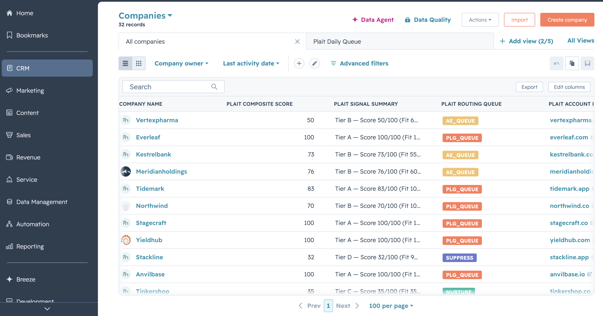
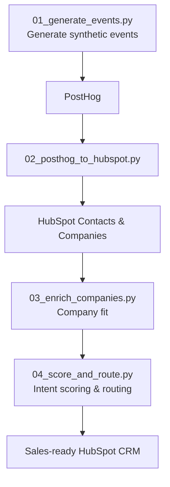
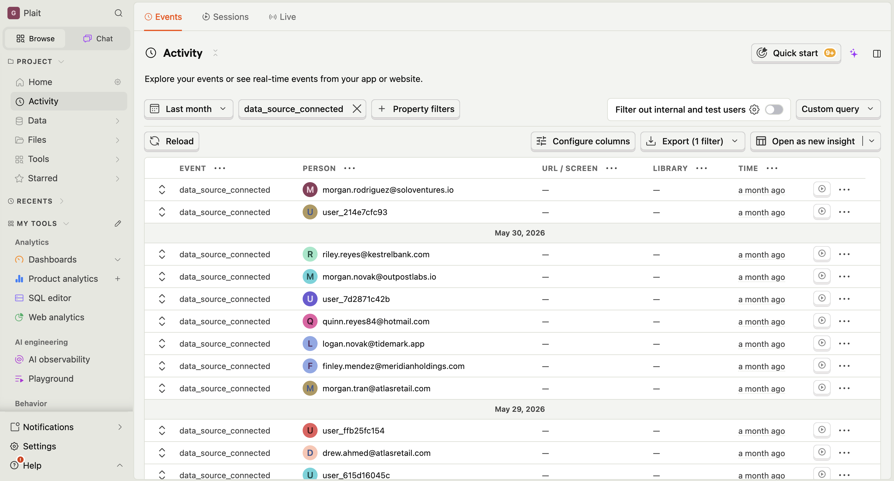
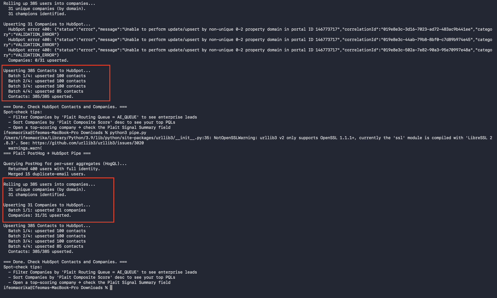

# What Sales Sees

A PLG signal pipeline that turns product usage into sales-ready accounts.

I built a PLG signal pipeline that watches how people use a free product and tells sales which accounts are worth contacting based on that behavior.

Product-led companies collect thousands of product events every day, but raw event data isn't something sales teams can act on. This project shows how behavioral data can be turned into qualified accounts by combining product analytics, CRM automation, company enrichment, and lead scoring into a single pipeline.

## What it does
  - Captures product usage
  - Identifies behaviours that indicate buying intent
  - Enriches each company with firmographic data (size, industry, funding, and tech stack)
  - Scores and grades every account
  - Delivers a sales-ready view in HubSpot
    
Plait, the product this pipeline runs on, is fictional, and the event data is entirely synthetic. Real PLG companies rarely share their product event streams, so I generated a realistic dataset instead.

Everything downstream of that dataset is real. The pipeline makes real API calls to PostHog and HubSpot, scores accounts using genuine buying signals, and routes them using the same kinds of rules a sales team would use in production.

The pipeline doesn't treat synthetic data any differently from real data. It simply processes whatever events arrive through the PostHog and HubSpot APIs. I haven't had the opportunity to run it against a real product's event stream yet, but nothing in the implementation depends on the data being synthetic.

>  If you've got a real PLG event stream and want to test this on it, I'd genuinely love to see what breaks.

## What it produces

The end result lives in HubSpot: every account scored, graded A–D, routed to the right queue, and given a plain-English summary of why it matters. 



## How the pipeline works


The four scripts are run in order. Each depends on the previous one's output.

## The problem it solves
Every freemium product has the same problem: not everyone who signs up is worth a sales call. Some explore the product out of curiosity, some evaluate it seriously, and some are ready to buy. The challenge is telling the difference.

At the same time, the information needed to make that decision is split across different systems. Product behaviour lives in analytics tools like PostHog, while sales teams work in a CRM such as HubSpot. Without connecting the two, sales either misses promising accounts or spends time chasing the wrong ones.

This pipeline bridges that gap. It captures product behavior, identifies buying signals, enriches each account with company context, scores its sales potential, and delivers a sales-ready view in HubSpot showing who to contact and why.

## About Plait
Plait is the fictional product this pipeline runs on. It's a self-serve analytics platform where teams connect data sources, build dashboards, and collaborate with colleagues.

I modeled it after a typical product-led SaaS because it naturally produces the kinds of behaviors sales teams care about: onboarding, activation, collaboration, feature adoption, pricing-page visits, and eventually upgrade intent.


| Tier | Price | Limits |
|------|-------|--------|
| Free | $0 | 1 data source, 3 dashboards, 1 seat, 30-day history |
| Team | $49/seat/month | Unlimited data sources and dashboards, 10 seats, scheduled reports |
| Business | $99/seat/month | SSO, audit logs, row-level permissions, embedded analytics |


## The four scripts

## 01_generate_events.py — synthetic event generator
Since no real company will hand over their user data, this script plays pretend. It creates 400 fake users, gives each one a personality, and acts out their behavior over 45 days.

I designed the personas based on the kinds of people who sign up for a SaaS product and used Anthropic’s Claude to write the code that generates their behavior.

**The personas:**

- **The serious buyer (15%)** —signs up with a work email, connects their data, builds dashboards, invites coworkers, hits the free limit, starts comparing us to competitors. This is the lead you want.
  
- **The tire-kicker (50%)** — signs up but mostly disappears. What makes these tricky is that several of them look like real interest at first glance. They come in five flavors
  - **The pure bounce** — signs up, does nothing, never comes back. The most occurring persona in any real product.
 - **The pricing sniffer** — glances at pricing and leaves. Looks interested, but isn't. (pricing visits look like buying intent, but a glance without any effort to use the product  is just curiosity.)
 - **The window shopper** —  — clicks around the sample dashboards, never connects their own data, never comes back. Looked at the product but never actually tried it.
 - **The false starter**  - connects a data source and runs a few queries, so on paper they "activated" (hit the action that usually signals a user found value). But they never followed through, so it was a false signal.
 - **The ghost** — disappears, then reappears weeks later with no real activity. One quiet return with no real activity is still nothing.
   
- **The small-company champion (20%)** - loves the product, uses it heavily, but works somewhere too small to pay per-seat. Hot interest but wrong fit.
  
- **The enterprise evaluator (5%)** - barely uses the product, but reads the security docs and requests a demo. Cold usage but strong fit.
- 
Roughly 28,000 events got generated and sent to PostHog, backdated so it looks like a month and a half of real activity.



*One thing I'm proud of: the script is safe to re-run. Every event carries a unique ID, so if it crashes halfway (mine did, when my wifi went off), running it again doesn't create duplicates.*

### 02_posthog_to_hubspot.py — Pipe it into the CRM

PostHog now holds 28,000 raw events, which is far too much for a salesperson. This script asks PostHog questions to qualify prospects ("for each person: how many dashboards? How many invites? When were they last active?"). It bundles the answers up per person and per company and pushes them into HubSpot CRM.

I call it a “pipe” but I like to think of it as a filter that merges duplicate users, groups people into companies by their email domain, and picks out each company's most active person as the "champion" who is the one a rep should reach out to first.

A hard lesson here was: I first matched people by an internal ID that regenerated every run, so HubSpot saw everyone as new every time and piled up duplicates. The fix was to match on email, which doesn't change. I know it is obvious in hindsight, but it gave me a headache on initial reruns.

### 03_enrich_companies.py — Add company context

Generate_events.py tells you someone's interest from their behavior. But it doesn't tell you whether they're worth selling to. A power user at a five-person startup probably won't pay enterprise prices. At their size, a free or cheaper tool does the job fine. But, a big company that's barely touched the product could still be the biggest deal of the quarter.

This script adds context about each company: how many employees, what industry, how much funding, and what tech they use. Then it turns that into a fit score. Basically, are they our kind of customer?

For the lookups, I included live integrations to Apollo, Hunter, and BuiltWith. I couldn't pay for them at this stage, though, and my companies are made up anyway, so the lookups come back empty. 

When that happens, the script fills in believable details that match each company's personality and tags every record so you can tell what's real, what's partly real, and what's invented.

My API code is to demonstrate the integration with these tools. I included the fallback to demonstrate how to handle missing data. Plus APIs will miss ~30% of domains, so this works.

### 04_score_and_route.py — score and route

This script decides who's actually worth calling. It looks at everything each account did and gives it a grade. Here's what shapes that grade:

Recent activity counts more than old activity. If someone looked at pricing yesterday, that matters more than someone who looked a month ago and never came back. So older signals slowly lose value over time instead of counting forever.

Variety counts more than volume. Two people going through the whole buying journey tells you more than ten people who each glanced at pricing once. So no single action can pile up and dominate the score on its own.

Some things cap the score no matter what. If an account went quiet for a few weeks, never connected any data, or deleted more than they built, the grade gets held down even if other signals look good. Those are warning signs not to ignore.

Instead of a number, every account gets a grade: A, B, C, or D. A means call today. D means leave it alone. A grade is easier for a rep to act on than a score out of 100.

To get an “A”, an account has to be both a good fit and clearly interested. A company that's perfect for us but went quiet doesn't get an “A”. A really keen lead at a company too small to ever pay doesn't either. Both have to be true.

There's also an exception for big companies. If a large company is barely using the product but reading the security docs, it skips straight to the enterprise sales team no matter its score. This is because quiet usage is normal when a big company’s buying committee is still evaluating.

## Things that broke (and the lessons)

### HubSpot’s domain field wasn’t unique

I assumed HubSpot’s built-in company domain property could uniquely identify companies. It can’t.



**Fix:** Create a custom unique property for plait_account_id and use that as the match key.

**Lesson:** Never assume third-party defaults match your data model.

### Re-running created duplicate contacts

I originally matched HubSpot contacts using an internal ID that changed every time the dataset was regenerated. HubSpot treated every rerun as a completely new set of people and happily created duplicates.

**Fix:** Match contacts by email and companies by a unique account ID instead of generated IDs.

**Lesson:** Always identify entities using stable natural keys, not values that can change between runs.

### My synthetic data made too many accounts Tier A

About 44% of accounts ended up as Tier A. That looked wrong because, in a real product, "call today" leads should be relatively rare.

I tried to tighten the scoring model by tweaking its thresholds, adding gates, and adjusting scoring rules, but the distribution barely changed. I realized the actual data was the issue. I'd deliberately generated a cohort with a much higher proportion of strong buyers than a real PLG product would have.

**Fix:** would be to generate a more realistic mix of users rather than forcing the scoring model to compensate for unrealistic input.

### My scoring script wasn't safe to rerun

Script 3 stored the scores like this:

```
Score 67/100 (Fit 80 / Intent 76)
```

Script 4 read those numbers to calculate the account's final tier, then rewrote the same field into a more detailed summary:

```
Tier A — Score 84/100 (Fit 80 / Intent 76, Conversion stage)
```

The numbers were still there, but the format had changed. Script 4 was written to look for Fit 80 / Intent 76)—with the closing bracket immediately after the intent score. After the rewrite, the closing bracket had moved, so the search failed even though the data was still present. The first run worked. The second run couldn't read the format it had created and quietly scored every account incorrectly.

**Fix:** Store the underlying scores separately from the text shown to users.

**Lesson:** If a script rewrites the format of data it later needs to read, run it twice before trusting it.

## Setup

### Requirements

- Python 3.9+
- A PostHog Cloud account (free tier works)
- A HubSpot account (free tier works)
  
Install the only dependency:

```bash
pip install requests
```

### Environment variables

Create a `plait_env.sh` file (gitignored) with your API credentials:

```bash
# PostHog — note the two different hosts and key types
export POSTHOG_API_KEY=phc_...            # Project (ingest) key, used by script 01
export POSTHOG_PERSONAL_KEY=phx_...       # Personal API key, used by scripts 02 & 04
export POSTHOG_PROJECT_ID=12345
export POSTHOG_HOST=https://us.posthog.com

# HubSpot
export HUBSPOT_TOKEN=pat-...

# Optional enrichment APIs (script 03 works without them)
export APOLLO_API_KEY=...
export HUNTER_API_KEY=...
export BUILTWITH_API_KEY=...
```

Load the environment before running the pipeline:

```bash
source plait_env.sh
```

### A PostHog quirk

PostHog uses two nearly identical hosts:

- `https://us.i.posthog.com` — event ingestion (used by `01_generate_events.py`)
- `https://us.posthog.com` — querying (used by `02_posthog_to_hubspot.py` and `04_score_and_route.py`)

It took me a painfully long time to figure this one out.

### HubSpot custom properties

The pipeline keeps raw behavioral data in PostHog and writes only the derived signals that sales needs into HubSpot.

**Contact properties**

- `plait_user_id`
- `plait_account_id`
- `plait_signup_date`
- `plait_last_active_date`
- `is_plait_champion`
  
**Company properties**

- `plait_account_id` (unique)
- `plait_composite_score`
- `plait_routing_queue` (PLG_QUEUE / AE_QUEUE / NURTURE / SUPPRESS)
- `plait_lead_tier` (A / B / C / D)
- `plait_signal_summary`
  
You’ll also need a HubSpot Private App token with read/write access to Contacts and Companies.

## Run the pipeline

Each script depends on the output of the previous one, so run them in order:

```bash
source plait_env.sh

# 1. Generate synthetic events into PostHog
# (Set POSTHOG_HOST=https://us.i.posthog.com)
python3 01_generate_events.py

# 2. Summarise behaviour and sync it to HubSpot
# (Set POSTHOG_HOST=https://us.posthog.com)
python3 02_posthog_to_hubspot.py

# 3. Enrich accounts with company data
python3 03_enrich_companies.py

# 4. Score, tier, and route accounts
python3 04_score_and_route.py
```

When the pipeline finishes, open HubSpot → Companies, sort by Plait Composite Score, or filter Lead Tier = A to see the accounts that should be contacted first.


