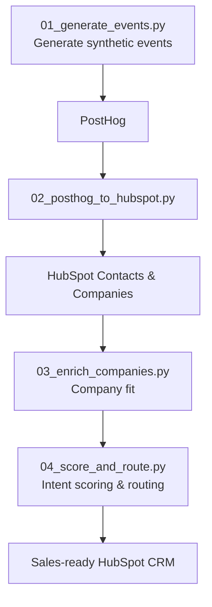

```mermaid
flowchart TD
    A[01_generate_events.py<br/>Generate synthetic events] --> B[PostHog]

    B --> C[02_posthog_to_hubspot.py]

    C --> D[HubSpot Contacts & Companies]

    D --> E[03_enrich_companies.py<br/>Company fit]

    E --> F[04_score_and_route.py<br/>Intent scoring & routing]

    F --> G[Sales-ready HubSpot CRM]
```
